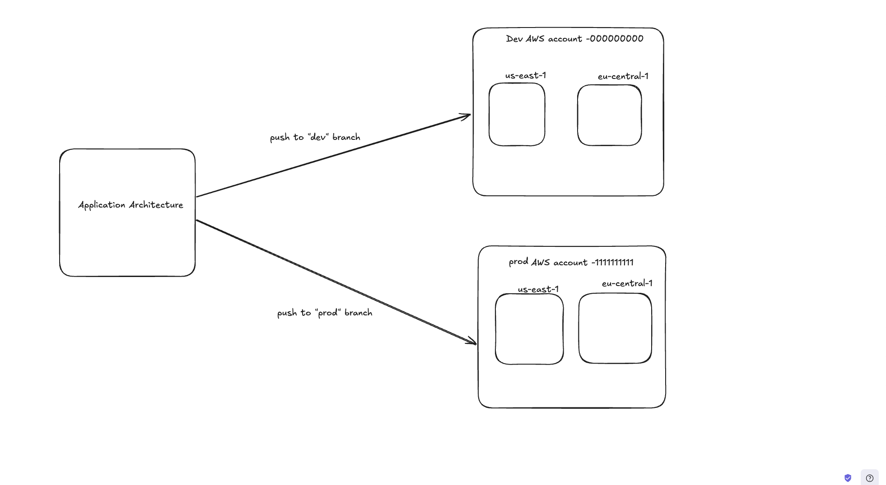

# Welcome to your CDK TypeScript project

This is a blank project for CDK development with TypeScript.

The `cdk.json` file tells the CDK Toolkit how to execute your app.

## Useful commands

* `npm run build`   compile typescript to js
* `npm run watch`   watch for changes and compile
* `npm run test`    perform the jest unit tests
* `npx cdk deploy`  deploy this stack to your default AWS account/region
* `npx cdk diff`    compare deployed stack with current state
* `npx cdk synth`   emits the synthesized CloudFormation template

## Architecture of the project

## For this Project you can follow the following steps to setup the pipeline in multiple acccounts
* Step 1:  Bootstrapping the AWS account
    You need to boot your AWS account and according to this project you need to run the bootstrap command like this:
    -> cdk bootstrap --trust <pipelineAccountId> --cloudformation-execution-policies arn:aws:iam::aws:policy/AdministratorAccess aws://<targetAccountId>/<targetRegion> -c pipeline=<branchName>

    Now you need to run this command 4 times [2 different accounts and 2 different regions]
* step 2: Connect the AWS codepipeline to your github account
    Go to you githubn account  then -> Settings-> Developer settings-> Personal Access tokens  and create a classic token and give it repo and admin: repo_hook access.
    A token will be generated , copy that token to someplace safe
    -> Open you aws console and open AWS secrets and create a new secret and store the token that you have generated in plain text.
    NOW THE NAME OF THE SECRET SHOULD BE github-token. otherwise it won't work

* step 3: Run the cdk deploy command 

    -> cdk deploy --all -c pipeline=<branchName>

    You would have to run this command twice with different branch name [say "dev" and "prod"]

